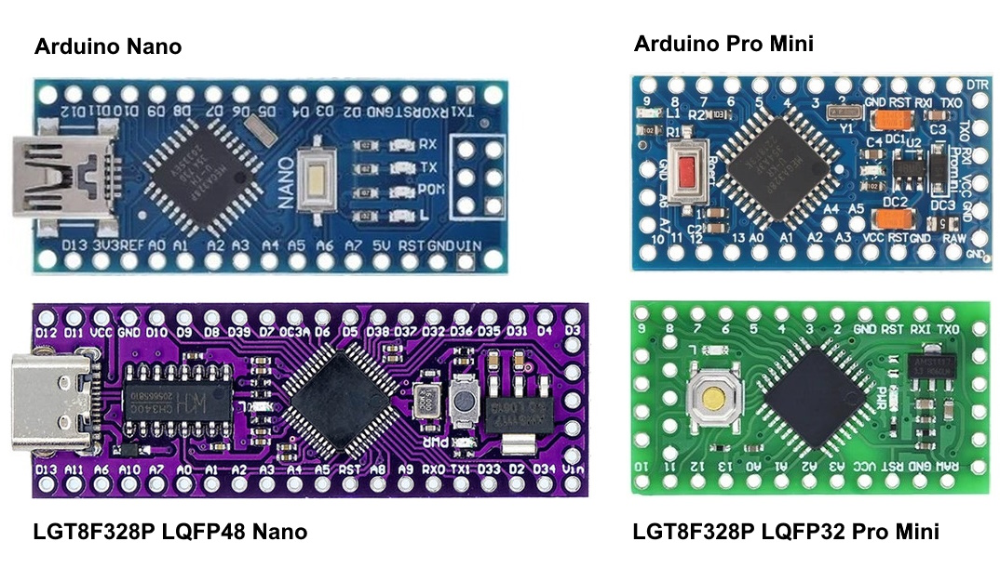
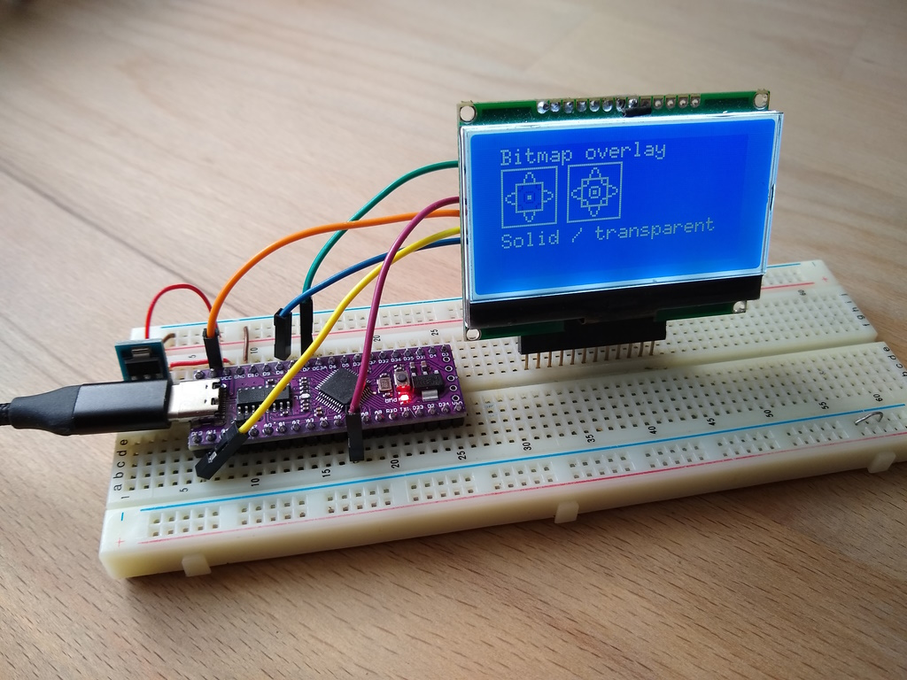
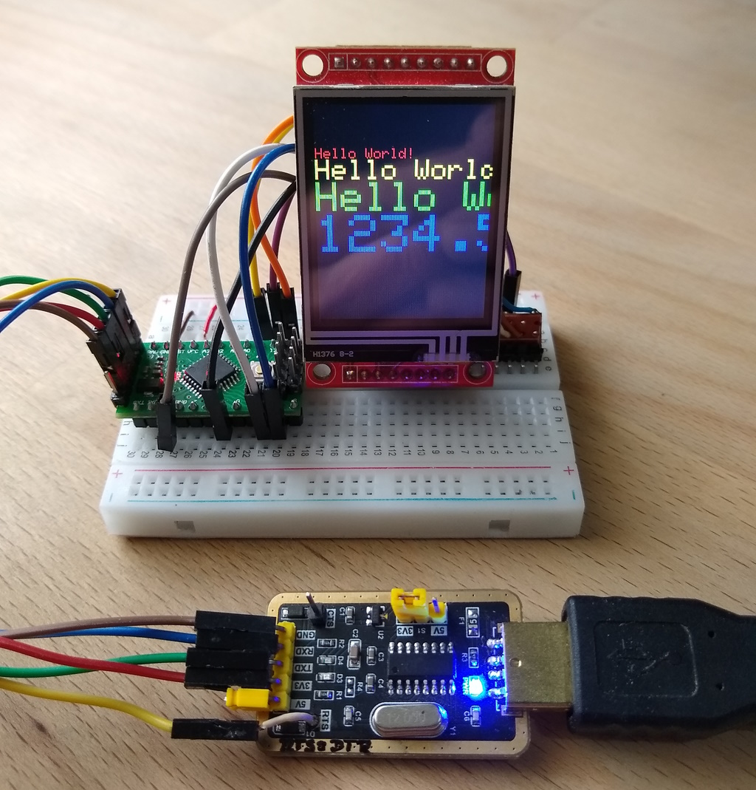

# LGT8F328P-Displays

# !!! under construction !!!

Testing cheap Arduino clones LGT8F328P with the lgt8fx Board Package from dbuezas and the display libraries u8g2 and TFT_eSPI.

## Tested Boards
The two tested LGT8F328P Boards and the original Arduino Boards :


More information :
- https://github.com/dbuezas/lgt8fx
- https://github.com/wollewald/lgt8fx
- https://wolles-elektronikkiste.de/minievb-boards-ein-ueberblick
- https://wolles-elektronikkiste.de/lgt8f328p-lqfp32-boards


## Quick installation 
- Install lgt8fx Board Package :
https://github.com/dbuezas/lgt8fx    
- Install the libraries "u8g2" and "TFT_eSPI".
- Copy the program file(s) from the folder "Arduino" and especially "Arduino/libraries", which contain all configuration files and the modified [TFT_eSPI_Generic.h](/Arduino/libraries/TFT_eSPI/Processors/TFT_eSPI_Generic.h).  
- Test u8g2 : [u8g2_GraphicsTest.ino](/Arduino/u8g2_GraphicsTest/u8g2_GraphicsTest.ino)
- Test TFT_eSPI : [TFT_eSPI_graphicstest_small_touch.ino](/Arduino/TFT_eSPI_graphicstest_small_touch/TFT_eSPI_graphicstest_small_touch.ino)

## u8g2-Library and Display GMG12864-06D
Test with LGT8F328P LQFP48 "Nano" and Display GMG12864-06D. 



Also tested with the LGT8F328P LQFP32 "Pro Mini" 3.3V and USB-TTL-Adapter (see below). Works fine and very fast.

Connections for LCD Display [GMG12864-06D](/pictures/GMG12864.jpg) :

| TFT  | GPIO | Description     |
| :--- | ---: | :-------------- |
| SI   |   11 | SPI MOSI        |
| SCL  |   13 | SPI SCLK        |
| CS   |    7 | CS              |
| RS   |    8 | DC              |
| RSE  |  RST | RESET Pin       |
| VDD  |      | 3.3V (5V)       |
| VSS  |      | GND             |
| A    |      | LED A -> 47Ω -> 3.3V (5V)|
| K    |      | LED K -> GND             |

The display can be used with 3,3V or 5V. In this test i used a 3.3V voltage regulator for VSS and backlight LED.

Configuration of the u8g2 library in [u8g2_GraphicsTest.ino](/Arduino/u8g2_GraphicsTest/u8g2_GraphicsTest.ino):
````java
#include <Arduino.h>
#include <U8g2lib.h>

#ifdef U8X8_HAVE_HW_SPI
#include <SPI.h>         // uses the SPI-library of the lgt8fx Board Package
#endif
#ifdef U8X8_HAVE_HW_I2C
#include <Wire.h>
#endif

U8G2_ST7565_ERC12864_ALT_F_4W_HW_SPI u8g2(U8G2_R0, /* cs=*/ 7, /* dc=*/ 8, /* reset=*/ U8X8_PIN_NONE);

#define CONTRAST 75      // don't forget, to set the contrast!

void setup(void) {
  u8g2.begin();
  u8g2.setContrast(CONTRAST); 
}

void loop(void) {
  //...
}  
````
## TFT_eSPI-Library and Touch-Display ST7735.

Test with the LGT8F328P LQFP36 "Mini Pro" 3.3V and USB-TTL-Adapter. 


Display and touch work fine with modification of TFT_eSPI\Processors\TFT_eSPI_Generic.h (see below).

Connections for Touch-Display [ST7735](/pictures/Touch_Display_1.8_SD.png) :

| GPIO | TFT   | Touch | SD-Card | Description      |
| ---: | :---- | :---- | :------ | :--------------- |
| 11   | SDA   | T_DIN | SD_MOSI | MOSI             |
| 12   |       | T_DO  | SD_MISO | MISO             |
| 13   | SCK   | T-CLK | SD_SCK  | CLK              |
|  8   | A0    |       |         | DC               |
| RST  | RESET |       |         | RST              |
|  7   | CS    |       |         | CS-TFT           |
|  4   |       | T_CS  |         | CS-Touch         |
|      |       |       | SD_CS   | CS-SD (not used) |
|      |       | T_IRQ |         | IRQ (not used)   |
|      | GND   |       |         | GND              |
|      | VCC   |       |         | 3.3V             |
|      | LED   |       |         | 3.3V             |


### The modification of TFT_eSPI\Processors\TFT_eSPI_Generic.h :

Replaced :

````java
...   
    #ifdef __AVR__ // AVR processors do not have 16 bit transfer
      #define tft_Write_8(C)   {SPDR=(C); while (!(SPSR&_BV(SPIF)));}
...      
`````
with :
````java
...
    #ifdef __AVR__ // AVR processors do not have 16 bit transfer
      #ifdef __LGT8FX8P__
        #define tft_Write_8(C)   {SPDR=(C); asm volatile("nop"); while((SPFR & _BV(RDEMPT))); SPFR=_BV(RDEMPT)|_BV(WREMPT); }
      #else
        #define tft_Write_8(C)   {SPDR=(C); while (!(SPSR&_BV(SPIF)));}
      #endif  
...
````

Solution found here :
- https://github.com/dbuezas/lgt8fx/blob/master/lgt8f/libraries/SPI/src/SPI.h
- https://github.com/adafruit/Adafruit-GFX-Library/pull/313/commits/14aa943754aac8825e75f9ff75c308bf7ada7ab4

### SPI-Transfer for AVR and LGT8FX8P in SPI.h :
````java
inline static uint8_t transfer(uint8_t data) {
  uint8_t rcvd;
	  
  SPDR = data;
  asm volatile("nop");
  #if defined(__LGT8FX8P__)
    while((SPFR & _BV(RDEMPT)));
    rcvd = SPDR;
    SPFR = _BV(RDEMPT) | _BV(WREMPT);
  #else
    while(!(SPSR & _BV(SPIF)));
    rcvd = SPDR;
  #endif

  return rcvd;
}
````
